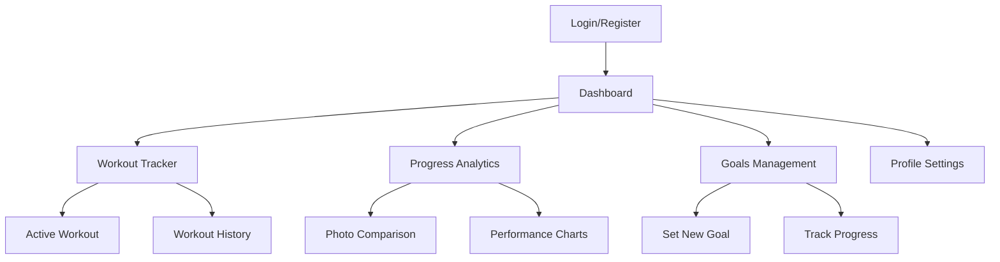

## 1. Product Overview

A comprehensive Fitness Coaching System built with MERN stack that enables users to track workouts, monitor progress, and receive personalized coaching recommendations. The system handles all fitness calculations on the backend while providing an intuitive dark-themed interface for users to manage their fitness journey.

The platform serves fitness enthusiasts and personal trainers by offering workout tracking, progress analytics, and goal management tools with a focus on data-driven insights and user engagement.

## 2. Core Features

### 2.1 User Roles

| Role | Registration Method | Core Permissions |
|------|---------------------|------------------|
| Fitness User | Email registration | Track workouts, view progress, set goals, upload progress photos |
| Coach | Admin assignment | Create workout plans, monitor client progress, provide feedback |
| Admin | System admin | Manage users, oversee system settings, handle content moderation |

### 2.2 Feature Module

Our Fitness Coaching System consists of the following main pages:

1. **Dashboard**: Overview of fitness metrics, recent workouts, progress charts
2. **Workout Tracker**: Log exercises, track sets/reps, rest timers, workout history
3. **Progress Analytics**: Visual charts, body measurements, photo comparisons
4. **Goals Management**: Set fitness goals, track completion, milestone achievements
5. **Profile Settings**: Personal info, fitness preferences, account management

### 2.3 Page Details

| Page Name | Module Name | Feature description |
|-----------|-------------|---------------------|
| Dashboard | Metrics Overview | Display key fitness metrics (total workouts, calories burned, streak days) with real-time updates |
| Dashboard | Recent Activity | Show last 5 workouts with quick view of exercises performed and duration |
| Dashboard | Progress Charts | Visual representation of weight, strength, and endurance improvements using Recharts |
| Workout Tracker | Exercise Logger | Search and select exercises, input sets/reps/weight, automatic rest timer between sets |
| Workout Tracker | Active Workout | Live workout session with timer, exercise progression, ability to modify sets on-the-fly |
| Workout Tracker | History View | Filterable workout history with detailed exercise breakdown and performance trends |
| Progress Analytics | Body Measurements | Track weight, body fat percentage, muscle measurements with trend analysis |
| Progress Analytics | Photo Progress | Upload progress photos to Cloudinary, side-by-side comparison tool, date-based organization |
| Progress Analytics | Performance Charts | Strength progression, endurance improvements, workout frequency analysis |
| Goals Management | Goal Creation | Set SMART goals (Specific, Measurable, Achievable, Relevant, Time-bound) with target dates |
| Goals Management | Progress Tracking | Visual progress bars, milestone notifications, achievement badges system |
| Goals Management | Goal History | Archive completed goals, view historical performance data, success rate statistics |
| Profile Settings | Personal Information | Update basic info, fitness level assessment, workout preferences configuration |
| Profile Settings | Account Security | Password management, email preferences, data export options |

## 3. Core Process

**User Flow:**
1. User registers with email and completes fitness assessment
2. User sets initial fitness goals and baseline measurements
3. User logs workouts through the workout tracker
4. System calculates progress metrics and updates analytics
5. User views progress through dashboard and analytics pages
6. User adjusts goals based on achieved results

**Coach Flow:**
1. Coach reviews assigned client progress through dashboard
2. Coach creates customized workout plans for clients
3. Coach monitors client adherence and provides feedback
4. Coach adjusts plans based on client progress data

## 4. User Interface Design

### 4.1 Design Style
- **Primary Colors**: Black (#000000) background, Orange (#FF6B35) accent
- **Secondary Colors**: Dark gray (#1A1A1A) for cards, Light gray (#CCCCCC) for text
- **Button Style**: Rounded corners (8px radius), orange background with hover effects
- **Font**: Inter for headers, Roboto for body text
- **Layout**: Card-based design with consistent spacing (16px grid system)
- **Icons**: Fitness-themed icons using React Icons library

### 4.2 Page Design Overview

| Page Name | Module Name | UI Elements |
|-----------|-------------|-------------|
| Dashboard | Metrics Cards | Black background with orange accent borders, grid layout of 4 cards showing key metrics |
| Dashboard | Charts Section | Dark-themed Recharts with orange data lines, responsive grid layout |
| Workout Tracker | Exercise Cards | Dark cards with orange headers, collapsible sections for exercise details |
| Workout Tracker | Timer Display | Large orange digital timer with start/pause controls |
| Progress Analytics | Photo Grid | Masonry layout for progress photos with hover overlay effects |
| Progress Analytics | Chart Containers | Full-width dark containers with orange accent borders and legends |
| Goals Management | Goal Cards | Progress bar with orange fill, deadline countdown, achievement badges |
| Profile Settings | Form Sections | Dark input fields with orange focus borders, card-based form grouping |

### 4.3 Responsiveness
- Desktop-first design approach with mobile adaptation
- Sidebar navigation collapses to hamburger menu on mobile
- Grid layouts adjust from 4-column (desktop) to 2-column (tablet) to 1-column (mobile)
- Touch-optimized buttons with minimum 44px touch targets
- Responsive charts that maintain readability on all devices