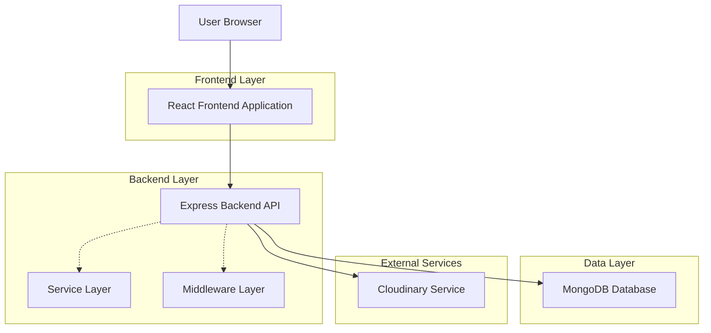
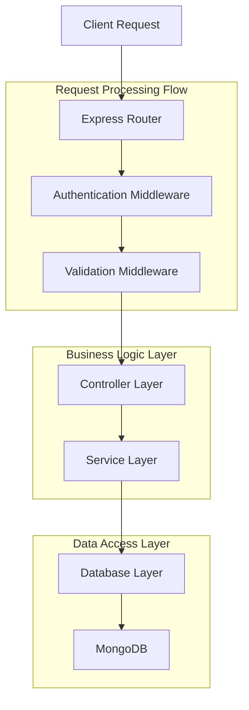
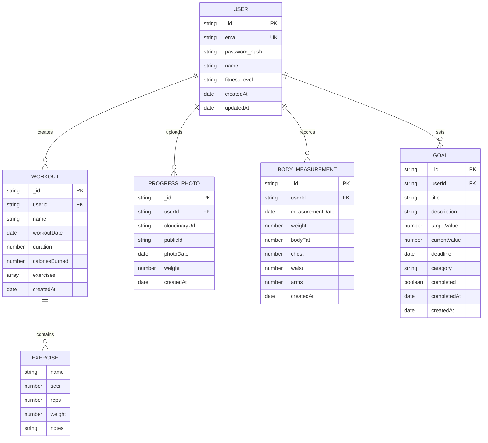

## 1. Architecture design



## 2. Technology Description

- Frontend: React@18 + Axios + Recharts + TailwindCSS
- Backend: Node.js@18 + Express@4 + MongoDB
- Database: MongoDB with Mongoose ODM
- File Storage: Cloudinary for image uploads
- Initialization Tool: Create React App (frontend), Express Generator (backend)
- Authentication: JWT-based authentication
- Error Handling: Custom middleware for centralized error handling

## 3. Route definitions

| Route | Purpose |
|-------|---------|
| / | Dashboard page, main overview of fitness metrics |
| /login | Login page, user authentication |
| /register | Registration page, new user signup |
| /workouts | Workout tracker page, exercise logging |
| /progress | Progress analytics page, charts and measurements |
| /goals | Goals management page, set and track fitness goals |
| /profile | User profile page, account settings |
| /workout/:id | Individual workout detail page |

## 4. API definitions

### 4.1 Authentication APIs

**User Registration**
```
POST /api/auth/register
```

Request:
| Param Name | Param Type | isRequired | Description |
|------------|------------|------------|-------------|
| email | string | true | User email address |
| password | string | true | User password (min 8 characters) |
| name | string | true | User full name |
| fitnessLevel | string | true | Beginner/Intermediate/Advanced |

Response:
| Param Name | Param Type | Description |
|------------|------------|-------------|
| token | string | JWT authentication token |
| user | object | User object without password |

**User Login**
```
POST /api/auth/login
```

Request:
| Param Name | Param Type | isRequired | Description |
|------------|------------|------------|-------------|
| email | string | true | User email address |
| password | string | true | User password |

Response:
| Param Name | Param Type | Description |
|------------|------------|-------------|
| token | string | JWT authentication token |
| user | object | User object without password |

### 4.2 Workout APIs

**Create Workout**
```
POST /api/workouts
```

Request:
| Param Name | Param Type | isRequired | Description |
|------------|------------|------------|-------------|
| name | string | true | Workout name |
| exercises | array | true | Array of exercise objects |
| duration | number | true | Workout duration in minutes |
| caloriesBurned | number | false | Estimated calories burned |

**Get Workout History**
```
GET /api/workouts/history
```

Query Parameters:
| Param Name | Param Type | Description |
|------------|------------|-------------|
| page | number | Page number for pagination |
| limit | number | Number of items per page |
| dateFrom | string | Filter workouts from this date |
| dateTo | string | Filter workouts until this date |

### 4.3 Progress APIs

**Upload Progress Photo**
```
POST /api/progress/photos
```

Request (multipart/form-data):
| Param Name | Param Type | isRequired | Description |
|------------|------------|------------|-------------|
| photo | file | true | Image file (max 5MB) |
| date | string | true | Photo date (YYYY-MM-DD) |
| weight | number | false | Current weight |

**Update Body Measurements**
```
PUT /api/progress/measurements
```

Request:
| Param Name | Param Type | isRequired | Description |
|------------|------------|-------------|
| weight | number | false | Body weight in kg/lbs |
| bodyFat | number | false | Body fat percentage |
| chest | number | false | Chest measurement |
| waist | number | false | Waist measurement |
| arms | number | false | Arms measurement |
| date | string | true | Measurement date |

### 4.4 Goals APIs

**Create Goal**
```
POST /api/goals
```

Request:
| Param Name | Param Type | isRequired | Description |
|------------|------------|-------------|
| title | string | true | Goal title |
| description | string | true | Detailed goal description |
| targetValue | number | true | Numeric target value |
| currentValue | number | true | Starting/current value |
| deadline | string | true | Target completion date |
| category | string | true | Weight/Strength/Endurance/Other |

## 5. Server architecture diagram



## 6. Data model

### 6.1 Data model definition



### 6.2 Data Definition Language

**User Collection**
```javascript
const userSchema = new mongoose.Schema({
  email: { type: String, required: true, unique: true },
  password_hash: { type: String, required: true },
  name: { type: String, required: true },
  fitnessLevel: { type: String, enum: ['Beginner', 'Intermediate', 'Advanced'], default: 'Beginner' },
  createdAt: { type: Date, default: Date.now },
  updatedAt: { type: Date, default: Date.now }
});
```

**Workout Collection**
```javascript
const workoutSchema = new mongoose.Schema({
  userId: { type: mongoose.Schema.Types.ObjectId, ref: 'User', required: true },
  name: { type: String, required: true },
  workoutDate: { type: Date, default: Date.now },
  duration: { type: Number, required: true },
  caloriesBurned: { type: Number, default: 0 },
  exercises: [{
    name: { type: String, required: true },
    sets: { type: Number, required: true },
    reps: { type: Number, required: true },
    weight: { type: Number, default: 0 },
    notes: { type: String, default: '' }
  }],
  createdAt: { type: Date, default: Date.now }
});
```

**Progress Photo Collection**
```javascript
const progressPhotoSchema = new mongoose.Schema({
  userId: { type: mongoose.Schema.Types.ObjectId, ref: 'User', required: true },
  cloudinaryUrl: { type: String, required: true },
  publicId: { type: String, required: true },
  photoDate: { type: Date, required: true },
  weight: { type: Number },
  createdAt: { type: Date, default: Date.now }
});
```

**Goal Collection**
```javascript
const goalSchema = new mongoose.Schema({
  userId: { type: mongoose.Schema.Types.ObjectId, ref: 'User', required: true },
  title: { type: String, required: true },
  description: { type: String, required: true },
  targetValue: { type: Number, required: true },
  currentValue: { type: Number, required: true },
  deadline: { type: Date, required: true },
  category: { type: String, enum: ['Weight', 'Strength', 'Endurance', 'Other'], required: true },
  completed: { type: Boolean, default: false },
  completedAt: { type: Date },
  createdAt: { type: Date, default: Date.now }
});
```