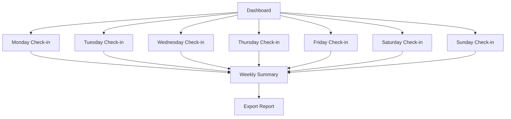

## 1. Product Overview
A premium fitness tracking SaaS platform that transforms weekly check-in spreadsheets into an interactive digital experience. Clients log daily nutrition and progress data across 7 days, with automated macro calculations and weekly summaries delivered through a modern dashboard interface.

Target market: Fitness coaches, nutritionists, and health-conscious individuals seeking professional-grade progress tracking with automated insights.

## 2. Core Features

### 2.1 User Roles
| Role | Registration Method | Core Permissions |
|------|---------------------|------------------|
| Client | Email registration | Create/edit own daily check-ins, view personal analytics |
| Coach | Admin invitation | View all client data, manage client accounts |

### 2.2 Feature Module
The weekly check-in system consists of the following main pages:
1. **Dashboard**: Client overview, weekly summary cards, navigation hub
2. **Monday Check-in**: Nutrition tracking, progress metrics, macro calculations
3. **Tuesday Check-in**: Daily data entry with same structure as Monday
4. **Wednesday Check-in**: Mid-week progress tracking and adjustments
5. **Thursday Check-in**: Continued daily monitoring and data collection
6. **Friday Check-in**: End-of-week data compilation
7. **Saturday Check-in**: Weekend progress maintenance
8. **Sunday Check-in**: Final weekly data entry
9. **Weekly Summary**: Aggregated analytics, charts, trends analysis

### 2.3 Page Details
| Page Name | Module Name | Feature description |
|-----------|-------------|---------------------|
| Dashboard | Navigation Sidebar | Navigate between days and summary, display client name, show current week progress |
| Dashboard | Summary Cards | Display average calories, total steps, workout completion rate, average weight |
| Dashboard | Quick Stats | Show today's completion status, weekly progress indicator |
| Daily Check-in | Client Info | Auto-populate client name/email, select week start date |
| Daily Check-in | Nutrition Card | Input calories, protein, carbs, fat, fiber, water intake with real-time validation |
| Daily Check-in | Progress Card | Enter weight, steps, sleep hours, workout completion toggle, optional notes |
| Daily Check-in | Macro Distribution | Display calculated macro percentages in pie chart format |
| Daily Check-in | Save Controls | Submit daily data, show success/error feedback |
| Weekly Summary | Nutrition Trends | Line chart showing daily calorie intake, macro distribution over week |
| Weekly Summary | Progress Analytics | Weight trend line, step count bar chart, sleep pattern visualization |
| Weekly Summary | Achievement Metrics | Workout completion percentage, average macros, total weekly steps |
| Weekly Summary | Export Options | Generate PDF report, share weekly summary via email |

## 3. Core Process
**Client Flow:**
1. User registers with email and creates client profile
2. Dashboard loads showing current week overview
3. User navigates to specific day via sidebar
4. Daily check-in page displays with pre-filled client information
5. User enters nutrition data (macros auto-calculate in real-time preview)
6. User inputs progress metrics and workout status
7. Data saves to backend with validation
8. Weekly summary automatically updates with new calculations
9. User reviews comprehensive analytics and trends

## 4. User Interface Design

### 4.1 Design Style
- **Primary Colors**: Deep blue (#1e40af) with electric blue accents (#3b82f6)
- **Secondary Colors**: Dark slate (#1e293b) background with glassmorphism cards
- **Button Style**: Gradient backgrounds with subtle glow effects on hover
- **Typography**: Inter font family, 16px base size with responsive scaling
- **Layout**: Card-based design with translucent frosted glass effects
- **Icons**: Minimalist line icons with consistent 2px stroke width
- **Animations**: Smooth transitions (300ms ease), loading skeletons, progress bar fills

### 4.2 Page Design Overview
| Page Name | Module Name | UI Elements |
|-----------|-------------|-------------|
| Dashboard | Sidebar | Dark translucent background, blue active state indicators, smooth slide transitions |
| Dashboard | Summary Cards | Glassmorphism effect with backdrop blur, gradient borders, animated number counters |
| Daily Check-in | Nutrition Card | Rounded corners, subtle shadows, input fields with blue focus rings |
| Daily Check-in | Macro Chart | Interactive pie chart with hover tooltips, animated segment transitions |
| Weekly Summary | Trend Charts | Line charts with gradient fills, responsive grid layout, dark theme optimized |
| Weekly Summary | Achievement Badges | Circular progress indicators, celebratory animations for milestones |

### 4.3 Responsiveness
Desktop-first design with mobile adaptation:
- Sidebar collapses to hamburger menu on tablets/mobile
- Cards stack vertically on smaller screens
- Charts maintain readability with touch-friendly interactions
- Form inputs enlarge for mobile touch targets

### 4.4 Data Visualization Guidelines
- Macro distribution: Interactive pie chart with percentage labels
- Weekly trends: Smooth line charts with data point markers
- Progress indicators: Animated circular progress bars
- Color coding: Blue for protein, green for carbs, orange for fats
- Hover states: Detailed tooltips with exact values and timestamps