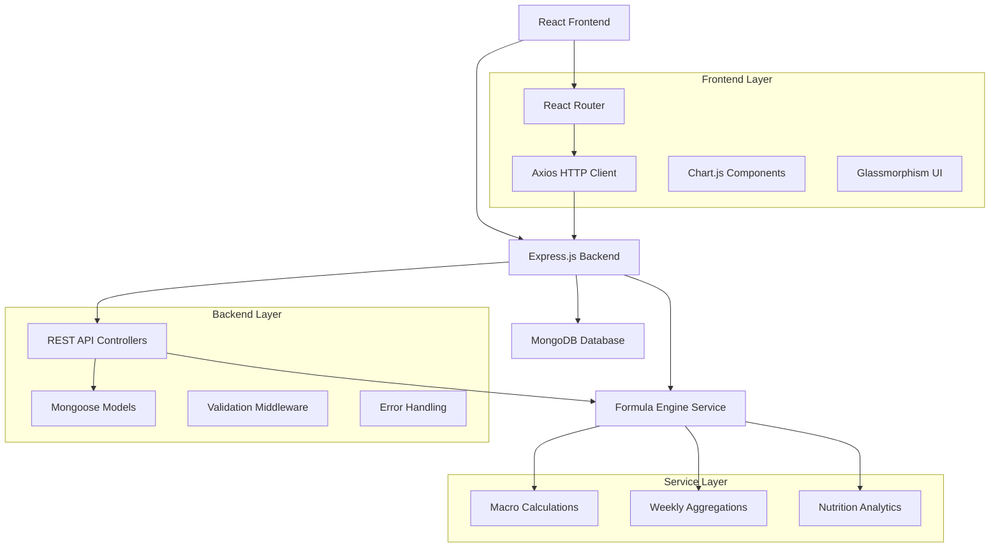
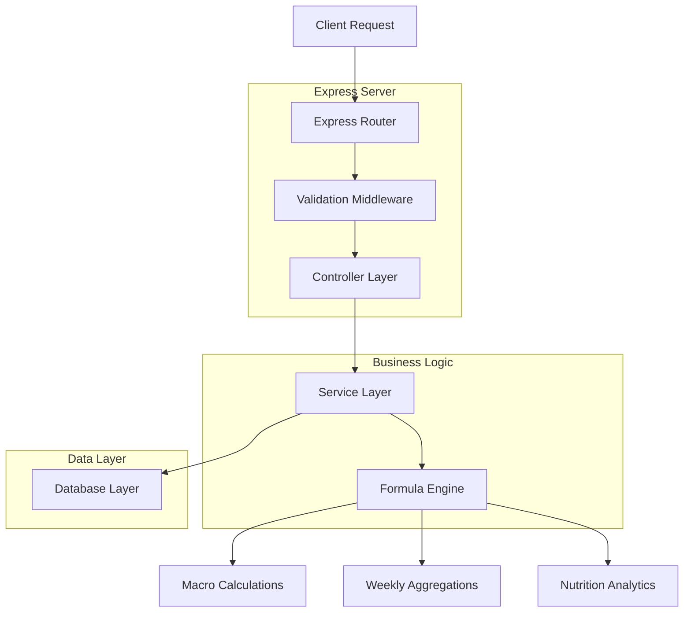
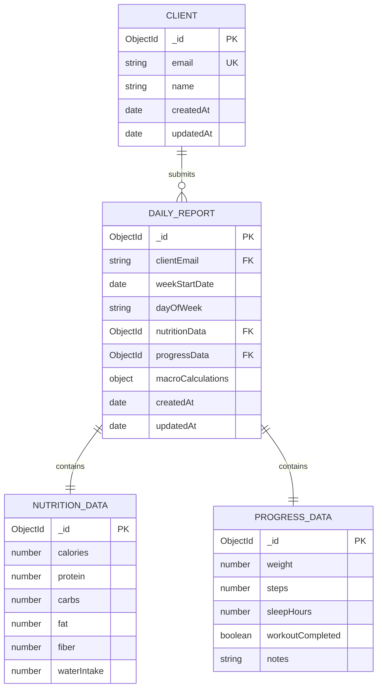

## 1. Architecture design



## 2. Technology Description
- Frontend: React@18 + React Router@6 + Axios + Chart.js + Tailwind CSS
- Initialization Tool: Create React App
- Backend: Node.js@18 + Express.js@4 + Mongoose@7
- Database: MongoDB@6 (Cloud Atlas)
- Additional Libraries: cors, dotenv, express-validator, bcryptjs, jsonwebtoken

## 3. Route definitions
| Route | Purpose |
|-------|---------|
| / | Dashboard homepage with weekly overview |
| /monday | Monday daily check-in form |
| /tuesday | Tuesday daily check-in form |
| /wednesday | Wednesday daily check-in form |
| /thursday | Thursday daily check-in form |
| /friday | Friday daily check-in form |
| /saturday | Saturday daily check-in form |
| /sunday | Sunday daily check-in form |
| /weekly-summary | Comprehensive weekly analytics |
| /api/reports | POST - Create new daily report |
| /api/reports/:email | GET - Retrieve all reports for client |
| /api/reports/:id | PUT - Update existing report |
| /api/weekly/:email/:week | GET - Get weekly summary data |

## 4. API definitions

### 4.1 Daily Report APIs

**Create Daily Report**
```
POST /api/reports
```

Request:
| Param Name | Param Type | isRequired | Description |
|------------|------------|------------|-------------|
| clientEmail | string | true | Client email identifier |
| weekStartDate | date | true | Monday of current week |
| dayOfWeek | string | true | Day name (Monday-Sunday) |
| nutrition | object | true | Nutrition data with macros |
| progress | object | true | Progress metrics |

**Nutrition Object Structure:**
```json
{
  "calories": 2500,
  "protein": 150,
  "carbs": 250,
  "fat": 80,
  "fiber": 35,
  "waterIntake": 3.5
}
```

**Progress Object Structure:**
```json
{
  "weight": 175.5,
  "steps": 8500,
  "sleepHours": 7.5,
  "workoutCompleted": true,
  "notes": "Feeling strong today"
}
```

**Response:**
```json
{
  "success": true,
  "data": {
    "_id": "report_id",
    "macroCalculations": {
      "proteinCalories": 600,
      "carbsCalories": 1000,
      "fatCalories": 720,
      "totalMacroCalories": 2320,
      "proteinPercentage": 25.9,
      "carbsPercentage": 43.1,
      "fatPercentage": 31.0
    }
  }
}
```

**Get Weekly Summary**
```
GET /api/weekly/:email/:weekStart
```

Response:
```json
{
  "success": true,
  "data": {
    "averageCalories": 2450,
    "averageProtein": 145,
    "averageWeight": 174.8,
    "totalSteps": 59500,
    "workoutCompletion": 85.7,
    "averageSleep": 7.2,
    "dailyBreakdown": [...]
  }
}
```

## 5. Server architecture diagram



## 6. Data model

### 6.1 Data model definition



### 6.2 Data Definition Language

**Client Collection**
```javascript
const clientSchema = new mongoose.Schema({
  email: {
    type: String,
    required: true,
    unique: true,
    lowercase: true
  },
  name: {
    type: String,
    required: true,
    trim: true
  }
}, {
  timestamps: true
});
```

**Daily Report Collection**
```javascript
const dailyReportSchema = new mongoose.Schema({
  clientEmail: {
    type: String,
    required: true,
    index: true
  },
  weekStartDate: {
    type: Date,
    required: true
  },
  dayOfWeek: {
    type: String,
    enum: ['Monday', 'Tuesday', 'Wednesday', 'Thursday', 'Friday', 'Saturday', 'Sunday'],
    required: true
  },
  nutrition: {
    calories: { type: Number, required: true, min: 0 },
    protein: { type: Number, required: true, min: 0 },
    carbs: { type: Number, required: true, min: 0 },
    fat: { type: Number, required: true, min: 0 },
    fiber: { type: Number, required: true, min: 0 },
    waterIntake: { type: Number, required: true, min: 0 }
  },
  progress: {
    weight: { type: Number, required: true, min: 0 },
    steps: { type: Number, required: true, min: 0 },
    sleepHours: { type: Number, required: true, min: 0, max: 24 },
    workoutCompleted: { type: Boolean, default: false },
    notes: { type: String, maxlength: 500 }
  },
  macroCalculations: {
    proteinCalories: Number,
    carbsCalories: Number,
    fatCalories: Number,
    totalMacroCalories: Number,
    proteinPercentage: Number,
    carbsPercentage: Number,
    fatPercentage: Number
  }
}, {
  timestamps: true
});

// Compound index for efficient weekly queries
dailyReportSchema.index({ clientEmail: 1, weekStartDate: 1, dayOfWeek: 1 }, { unique: true });
```

**Formula Engine Service**
```javascript
// services/formulaEngine.js
class FormulaEngine {
  static calculateMacros(nutrition) {
    const proteinCalories = nutrition.protein * 4;
    const carbsCalories = nutrition.carbs * 4;
    const fatCalories = nutrition.fat * 9;
    const totalMacroCalories = proteinCalories + carbsCalories + fatCalories;
    
    return {
      proteinCalories,
      carbsCalories,
      fatCalories,
      totalMacroCalories,
      proteinPercentage: (proteinCalories / totalMacroCalories) * 100,
      carbsPercentage: (carbsCalories / totalMacroCalories) * 100,
      fatPercentage: (fatCalories / totalMacroCalories) * 100
    };
  }
  
  static calculateWeeklySummary(reports) {
    const totals = reports.reduce((acc, report) => {
      acc.calories += report.nutrition.calories;
      acc.protein += report.nutrition.protein;
      acc.weight += report.progress.weight;
      acc.steps += report.progress.steps;
      acc.sleep += report.progress.sleepHours;
      acc.workouts += report.progress.workoutCompleted ? 1 : 0;
      return acc;
    }, {
      calories: 0, protein: 0, weight: 0, steps: 0, sleep: 0, workouts: 0
    });
    
    const days = reports.length;
    return {
      averageCalories: Math.round(totals.calories / days),
      averageProtein: Math.round(totals.protein / days),
      averageWeight: Math.round((totals.weight / days) * 10) / 10,
      totalSteps: totals.steps,
      workoutCompletion: Math.round((totals.workouts / days) * 100),
      averageSleep: Math.round((totals.sleep / days) * 10) / 10
    };
  }
}
```